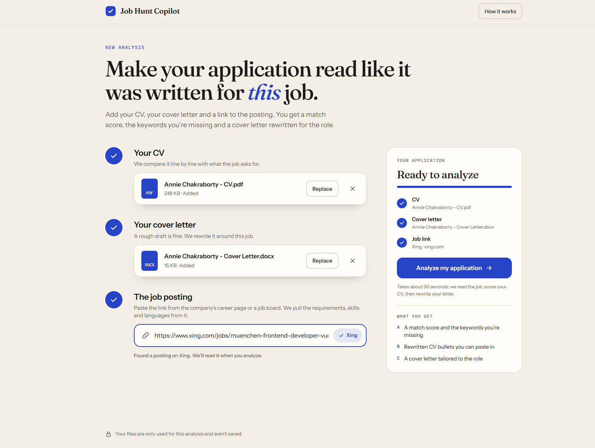
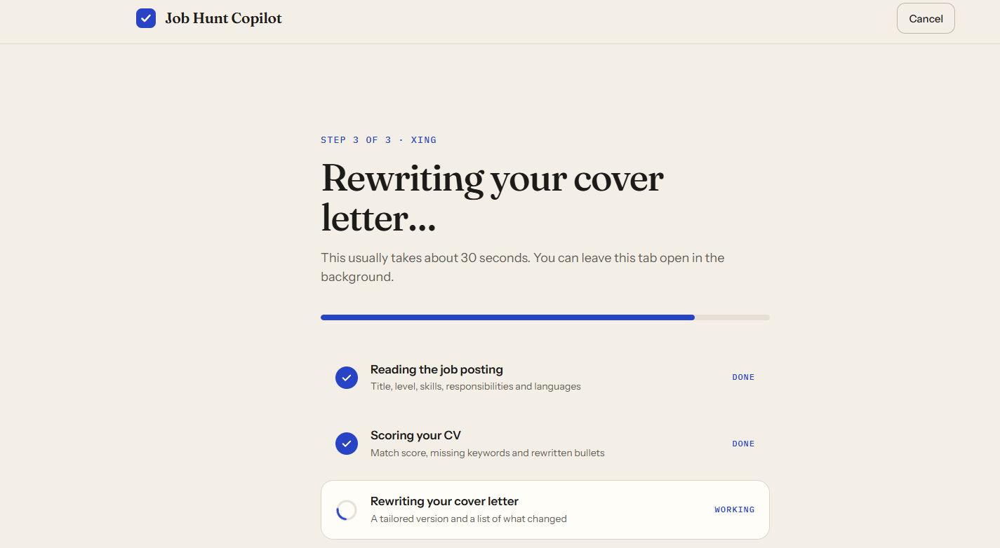
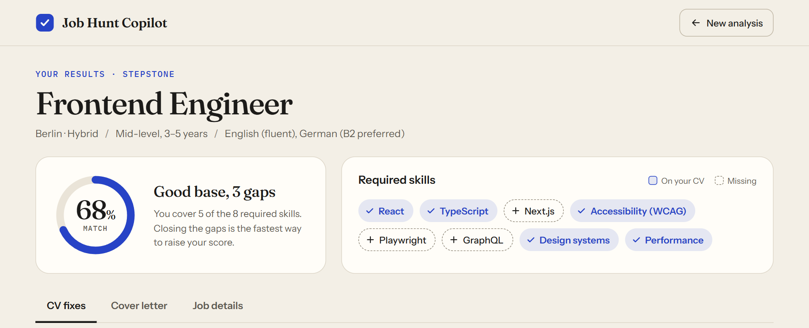
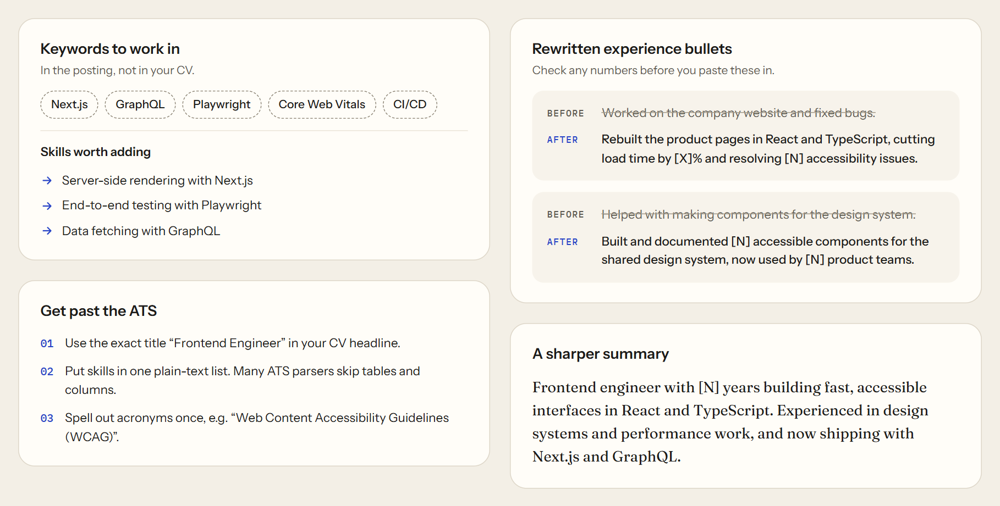
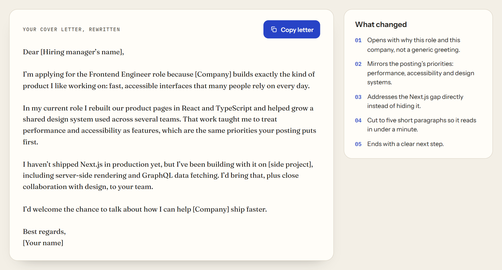
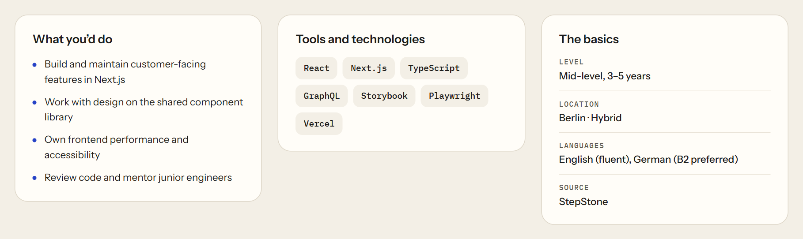

# 🚀 Job Hunt Copilot (AI Job Application Assistant)

An end-to-end AI-powered web application that helps users **analyze job postings**, **optimize their CV**, and **improve cover letters** based on real job descriptions.

This project was made as part of Give-a-Go [event](https://luma.com/q0k5v9mk) for Vercel, and vibe-coded using ChatGPT.

**🌐 Live demo: [Job Hunt Copilot](https://jobhuntct.netlify.app/)**

---

## 📌 Overview

This project allows users to:

1. Upload their **CV (PDF/DOCX)**
2. Upload their **Cover Letter**
3. Provide a **Job Posting URL** (from a company career page or a job board like StepStone, Indeed or Xing)

The system then:

* Extracts and processes all inputs
* Uses AI agents to analyze and optimize content
* Returns structured insights and improvements

---

## 📸 How It Works

A worked example with sample files for a Frontend Engineer role. The same walkthrough is in the app under **How it works**.

**1. Add your CV, cover letter and the job link.** Each step checks off as you fill it in, and the Analyze button unlocks when all three are in.



**2. Give it about 30 seconds.** Three AI passes run one after another: reading the job posting, scoring the CV, then rewriting the cover letter.



**3. See how well you match.** The match score and the job's required skills, with the ones missing from the CV marked.



**4. Fix your CV.** Keywords to work in, ATS tips, and before-and-after rewrites of experience bullets.



**5. Use the rewritten cover letter.** Copy it in one click and see what changed.



**6. Check the job details.** Responsibilities, tools, and the role's level, location and languages.



---

## 🧠 Key Features

### 📄 CV Analysis

* Match score against job description
* Missing keywords detection
* Skills to add
* ATS optimization tips
* Experience bullet point improvements
* Summary enhancement

---

### ✉️ Cover Letter Optimization

* Fully rewritten, job-tailored cover letter
* Key improvements explained

---

### 💼 Job Analysis

* Extracted job title, location, experience level
* Required skills and technologies
* Key responsibilities
* Language requirements

---

### 🔗 Job URL Parsing

* Supports job descriptions from company career pages and job boards like StepStone, Indeed, Xing, Greenhouse and Lever
* Extracts raw job text for AI processing

---

### ⚡ AI-Powered Pipeline

* Uses **Groq API (LLMs)** for fast inference
* Structured JSON outputs for reliable frontend rendering

---

## 🏗️ Tech Stack

### Backend

* Python
* Flask
* pdfplumber (PDF parsing)
* python-docx (DOCX parsing)
* BeautifulSoup + requests (web scraping)
* Groq API (LLM inference)
* python-dotenv (env management)

### Frontend

* React (Vite)
* Axios
* Inline CSS styling

---

## 📦 Installation

### 🔹 1. Clone the repository

```bash
git clone https://github.com/raihhann/Job_Hunter_VERCEL_EVENT.git
cd Job_Hunter_VERCEL_EVENT
```

---

### 🔹 2. Backend Setup

Create a virtual environment to store the packages needed to setup the environment.
```bash
python -m venv venv             # creates the virtual environment
./venv/Scripts/activate         # activates the virtual environment venv
```

Install the packages using `pip`.

```bash
pip install -r requirements.txt
```

---

### 🔹 3. Setup Environment Variables

Create a `.env` file in the root directory:

```env
GROQ_API_KEY=your_api_key_here
```

---

### 🔹 4. Run Backend

```bash
python app/app.py
```

Server will run on:

```text
http://127.0.0.1:5000
```

---

### 🔹 5. Frontend Setup

```bash
cd frontend
npm install
npm run dev
```

Frontend will run on:

```text
http://localhost:5173
```

---

## 🧪 API Endpoint

### POST `/api/analyze-cv`

#### Form Data:

* `cv` → file (PDF/DOCX)
* `cover_letter` → file (PDF/DOCX)
* `url` → job posting URL

---

### Example Response

```json
{
  "status": "success",
  "result": {
    "cv_analysis": { ... },
    "cover_letter": { ... },
    "job_analysis": { ... }
  }
}
```

---

## ⚠️ Known Limitations

* **LinkedIn links usually can't be read**: LinkedIn blocks requests from servers. The app warns about this and suggests using the same job from another source
* LLM outputs may occasionally require sanitization (handled in backend)
* No authentication or persistence (yet)

---

## 🚀 Future Improvements

* Job search agent (auto-fetch multiple jobs)
* Application tracking dashboard
* CV versioning system
* Downloadable improved CV/cover letter
* Async processing (Celery / Redis)
* Embedding-based job matching

---

## 🧠 Project Architecture

```text
Frontend (React)
        ↓
Flask API
        ↓
Parsing Layer (PDF/DOCX + Job URL)
        ↓
AI Processing (Groq LLM)
        ↓
Structured JSON Response
        ↓
Frontend Dashboard
```

---

## 👨‍💻 Authors

- **[Annie Chakraborty](https://www.linkedin.com/in/annie-chakraborty/)**
- **[Mohammed Raihan Soniwala](https://www.linkedin.com/in/raihan-edin)**
- **[Shweta Kadam](https://www.linkedin.com/in/shweta-k-37006a149/)**
- **[Abhishek Vijay Potekar](https://www.linkedin.com/in/abhishek-vijay-p-027126193)**

---

## 📄 License

This project is for educational and portfolio purposes.
